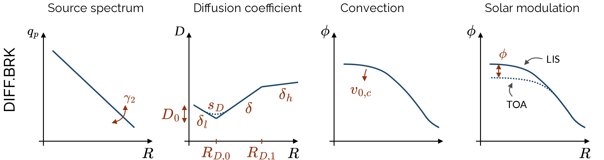
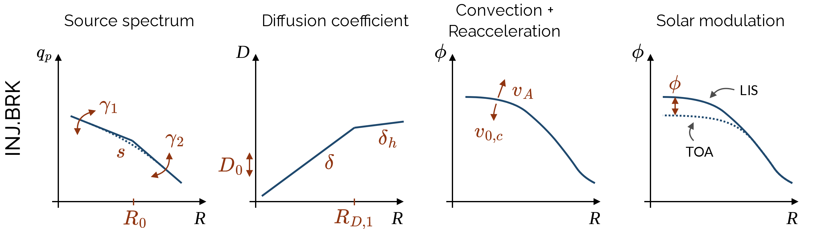

# Welcome to the Dark Ray Net  

## A Neural Network Based Simulation Tool for Indirect Dark Matter Searches

The recurrent neural networks (RNNs) provided in this tool can quickly simulate antiprotons, antideuterons, protons and Helium cosmic ray (CR) spectra at Earth, for an extensive range of parameters. 

## *v3 Updates*
$\overline{D}$*arkRayNet:* *In this most recent version we have added the possibility to simulate the cosmic ray fluxes for antideuterons. As for the antiprotons, the spectra can be predicted for a signal from dark matter annihilation **DM Antideuterons** and for secondary emission **Secondary Antideuterons**. The corresponding neural networks are trained as before on GALPROP simulations. The injection of cosmic rays from dark matter annihilation has been computed and presented in [1].*

## *v2 Updates*

*With respect to the initial release we have altered the initial parametrizations of the cosmic-ray propagation model and added an alternative setup. The respective setups and their usage are explained below. In addition to that, we now also release a sample of propagation parameters equally weighted according to their posterior in a MultiNest scan (for details see section 'Parameter Samples' and [2])*

The antiproton spectra consist of both a contribution of secondary emission and a component resulting from dark matter (DM) annihilation into various Standard Model particles that contribute to antiproton fluxes.
The tool is designed to predict measurable cosmic ray spectra for thousands of parameter sets in few seconds and thus enables quick parameter scans for indirect dark matter searches.
The training of the provided networks is based on GALPROP [3] simulations.
 
The following provides an introduction of the tool and its functions, as well as a description of the neural network involved and physical assumption on which the training data is based. 

**If you choose to use this tool, please cite ArXiv:2107.12395 [4] and  ArXiv:2303.07362 [2]. If you use it to predict antideuteron spectra, please cite ArXiv:2406.18642 [1]**
 
If you have questions or problems, file an issue in this repository or contact "nippel *at* physik *dot* rwth-aachen *dot* de" or "rathmann *at* physik *dot* rwth-aachen *dot* de"
________________________________________________________________
 
### Table of Contents
* [The Simulation Tool](#the-simulation-tool)
    * [Requirements and Installation](#requirements-and-installation)
    * [Functions](#functions)
    * [Examples](#examples)
* [Further Information](#further-information)
    * [Artificial Neural Networks](#artificial-neural-networks)
    * [Physical Assumptions](#physical-assumptions)
    * [Allowed Parameter Ranges](#allowed-parameter-ranges)
	* [Parameter Samples](#parameter-samples)
	* [Performance](#performance)
 
 ________________________________________________________________

## The Simulation Tool

### Requirements and Installation

This tool is based entirely on **Python 3** (it was validated with version Python 3.6.8). 
The packages needed to execute the functions in this tool are:

 - NumPy 
 - Tensorflow (version 2.6.2)
 - h5py (version 3.1.0)
 - Jupyter Notebook (optional, for example notebook)
 - Matplotlib (optional, for example notebook)
 
Optionally, you can run 

	source install_environment

to create and activate a virtual environment within the DarkRayNet directory where the correct dependencies are automatically installed. After running this file the environment can be deactivated with the 

	deactivate 
	
command and for the use of the tool with the corresponding dependencies reactivated with 

	source env/bin/activate
 
 ### Functions
 
**__init__** (propagation_model = 'DIFF.BRK', prevent_extrapolation = True, init_particles = ["DM Antiprotons", "Secondary Antiprotons"])
 - Loads the neural network
 - Options: 

*propagation_model* (default: 'DIFF.BRK') Choose the propagation model. Options are: DIFF.BRK, INJ.BRK. The setups are explained below. 

*prevent_extrapolation* (default: True) If any of the input parameters are outside of the trained parameter regions this raises a warning and the corresponding cosmic ray fluxes are zero. 

*init_particles* (default ["DM Antiprotons", "Secondary Antiprotons"])[9] Only for the particle types initialized here the corresponding networks can be called for flux predictions. This is necessary as each particle type has its own network and thus the networks are only loaded if they are needed. 

**predict** (particle_list,  propagation_parameters,  DM_mass  =  None,  DM_fs  =  None,  sigma_v  =  None, coalescence_parameters = None)

Inputs:

 - *List of desired comic ray spectra*
		 - Options:  

		 'DM Antiprotons, 
		 'Secondary Antiprotons', 
		 'DM Antideuterons',
		 'Secondary Antideuterons',
		 'Protons', 
		 'Deuterium', 
		 'Helium 3', 
		 'Helium 4'  

 - *Propagation Parameters*
	- List or array of sets of the propagation parameters, number of parameters changes with the propagation model:

			'DIFF.BRK': shape=(10,) or (N,10)

			'INJ.BRK': shape=(12,) or (N,12)
		
		Here, N is the number of parameter sets.
		 
	- Order and units: 

			'DIFF.BRK':	gamma_2,p 
			        		gamma_2
							D0 				[cm^2/s] 
							delta_l
							delta
							delta_h - delta
							R_D,0 			[MV]
							s_D
							R_D,1 			[MV]
							v_0,c 			[km/s]

			'INJ.BRK':	gamma_1,p
							gamma_1
							R_0 			[MV]
							s
							gamma_2,p
							gamma_2
							D_0 			[cm^2/s]
							delta
							delta_h - delta
							R_1,D 			[MV]
							v_0,C 			[km/s]
							v_A 			[km/s]
		
	 (see following section for more details)
 - *Dark Matter Mass*
		 - Default: None
		 - Required if list of desired comic ray spectra contains 'DM Antiprotons'
		 - Scalar or List/1D Array of length N (desired number of simulated fluxes)
		 - Input in units GeV
 - *Dark Matter Branching fractions "fs"*
		 - Default: None
		 - Required if list of desired comic ray spectra contains 'DM Antiprotons'
		 - Shape = (8,) or (N,8)
		 - Order: 
		 
		 q qbar (q = u+d+s), c cbar, b bbar, t tbar, W+W-, ZZ, gg, hh 
	 Please normalize your branching fractions so that for each flux the sum of the fractions are 1. 
 - *Dark Matter Annihilation Cross Section*
		 - Default: None
		 - Only relevant if list of desired comic ray spectra contains 'DM Antiprotons' or 'DM Antideuterons', if not given will be set to default ($3 \cdot 10^{-26}$ cm$^3$ s$^-1$)
		 - Scalar or List/1D Array of length N (desired number of simulated fluxes)
- *Coalescence Parameters*
		 - Default: None
		 - Only relevant if list of desired comic ray spectra contains 'Secondary Antideuterons' or 'DM Antideuterons'
		 - Shape = (2,) or (N,2)
		 - Here, r_Lambda_b is the parameter describing the rescaling of the Lambda_b production rate and p_c is the coalescence momentum in MeV/c. 
		The coalescence model is described in [1].
		 - Order: 
		 
		 	r_Lambda_b, p_c

Outputs:

 - List of tuples (flux, energy bins) for each element in the list of desired fluxes. 
		 - The length of the energy bins (len(E)) can vary for different particle types, as they're adjusted to the available measurements (AMS-02 [5], Voyager [6])
		 - Shape of each flux array: 
		 
		 (N, length(energy bins)) or (length(energy bins),) if N=1

Cosmic Ray spectra of identical charge number are evaluated at the identical energy bins and can thus easily be added. 

**create_INJ.BRK_parameters** (gamma_1p = 1.72, gamma_1 = 1.73, R_0 = 6.43e3, s = 0.33, gamma_2p = 2.45, gamma_2 = 2.39, D_0 = 4.1e28, delta = 0.372, delta_h_delta = -0.09, R_1D = 2.34e5, v_0c = 0.64, v_A = 20.4, N_identical = 1)

- **Helper function** that provides an array of propagation parameters suitable for the input of the predict function in the INJ.BRK model. 
- Input parameter defaults are taken from a fit of simulated antiproton, proton and helium fluxes to AMS-02 [5] and Voyager [6] data, see table 1 in [2]. 
- N_identical is set to 1 but can be increased if multiple identical sets of parameters are desired, for example for evaluation multiple sets of DM parameters at once.
- Output: numpy array of shape (12,) or (N_identical,12) if N_identical > 1.

**create_DIFF.BRK_parameters** (gamma_2p = 2.34, gamma_2 = 2.28, D0 = 3.78e28, delta_l = -0.66, delta = 0.52, delta_h_delta = -0.16, R_D0 = 3910, s_D = 0.41, R_D1 = 2.22e5, v_0c = 1.91, N_identical = 1)

- same as *create_INJ.BRK_parameters* for DIFF.BRK model
- Output: numpy array of shape (10,) or (N_identical,10) if N_identical > 1.

### Examples

We have set up three examples to aid further understanding of the usage of the tool.

- "Example_INJ.BRK.py" - A python file that prints out exemplary cosmic ray spectra based on arbitrarily defined input parameters. This file can also be run to check whether all requirements are installed correctly.
Here the propagation setup we chose for the example is the 'INJ.BRK' model with default parameters.

- "Example_DIFF.BRK_Notebook.ipynb" - A jupyter notebook in which some exemplary spectra are plotted for a visualization of the outputs of the tool. Here the propagation setup we chose for the example is the 'DIFF.BRK' model.

- "Example_Antideuteron_DRN.ipynb" - A jupyter notebook in which some exemplary antideuteron spectra are plotted to visualize the effects of the coalescence parameters.

________________________________________________________________

## Further Information

### Artificial Neural Networks

There is a total of six artificial neural networks (ANNs) implemented in the Dark Ray Net tool, each corresponding to one of the particle types. Note that for the secondary antiprotons and antideuterons we automatically include tertiary cosmic rays.  Tertiary DM antiprotons/antideuterons are included in the DM antiprotons/antideuterons and secondary protons are included in the proton spectra. 
The neural networks have a build in recurrent layer and are implemented using the Keras API [7] and Tensorflow as backend [8]. For a detailed description of the architectures and the training process see [4].
### Physical Assumptions

We only give a very brief overview here. Please refer to [2, 3] for a detailed description. 

**Cosmic Ray Propagation**

All cosmic ray spectra used for the network training are simulated with GALPROP [3] which numerically solves the transport equation in the Galaxy. 

$$\frac{\partial \psi_i (x, p, t)}{\partial t} = 
    q_i(x, p) +  
    \nabla \cdot \left(  D_{xx} \nabla \psi_i - V \psi_i \right) 
     +  \frac{\partial}{\partial p} p^2 D_{pp} \frac{\partial}{\partial p} \frac{1}{p^2} \psi_i - 
    \frac{\partial}{\partial p} \left( \frac{\mathrm{d} p}{\\mathrm{d} t} \psi_i  
    - \frac{p}{3} (\nabla \cdot V) \psi_i \right) -
    \frac{1}{\tau_{f,i}} \psi_i - \frac{1}{\tau_{r,i}} \psi_i$$

Refer to [4] for a detailed description of the propagation model used for the training of the neural networks.

The setup called 'DIFF.BRK' assumes two breaks in the diffusion coefficient and no reacceleration while the setup 'INJ.BRK' is modeled with a break in the injection spectrum and a reacceleration term. An intuitive understanding on how the source spectrum and diffusion coefficient modeling differs in these two model is given in the sketches below.

We assume only secondary emission of cosmic ray antiprotons through processes in the inter stellar medium.
The effect of solar modulation is not implemented in this tool, and should be added by the user when comparing the fluxes to experimental data. 

**Dark Matter Annihilation**

We consider WIMP dark matter annihilations in the Galactic dark matter halo. The dark matter density is modeled by a spherically symmetric NFW profile  (refer to [2], in which we provide parameters of the profile). In the case of antiprotons, the annihilation spectra into standard model particles is taken from the tool PPPC4DMID as computed with Pythia v8.135 by Cirelli et al. [9]. For antideuterons, we have computed the annihilation spectra in [1].

**The coalescence model**

We model the production of antideuterons with the MC-based coalescence model with two free parameters: the coalescence momentum p_c and a rescaling in the Lambda_b transition rate r_Lamdba_b (see [10] for further information). Antiprotons and antineutrons will form an antideuteron id their relative momentum is smaller than p_c which we tuned to the amount of antideuterons produced at LEP in e+ e- colisions.

________________________________________________________________

### Allowed Parameter Ranges

The neural networks are only accurate in the parameter regions they were trained on. The allowed parameter ranges are given in the following tables.

*'DIFF.BRK':*

| Parameter       | Unit   | Min          | Max          |
|-----------------|--------|--------------|--------------|
| gamma_2,p       |        | 2.25         | 2.37         |
| gamma_2         |        | 2.19         | 2.31         |
| D0              | cm^2/s | 3.41 * 10^28 | 4.45 * 10^28 |
| delta_l         |        | -0.97        | -0.37        |
| delta           |        | 0.48         | 0.6          |
| delta_h - delta |        | -0.2         | -0.08        |
| R_D,0           | MV     | 3044         | 4928         |
| s_D             |        | 0.31         | 0.51         |
| R_D,1           | MV     | 1.22         | 3.15 * 10^5  |
| v_0,c           | km/s   | 0            | 14.5         |

*'INJ.BRK':*

| Parameter       | Unit   | Min          | Max          |
|-----------------|--------|--------------|--------------|
| gamma_1,p       |        | 1.60         | 1.85         |
| gamma_1         |        | 1.60         | 1.85         |
| R_0             | MV     | 4939         | 8765         |
| s               |        | 0.22         | 0.46         |
| gamma_2,p       |        | 2.51         | 2.50         |
| gamma_2         |        | 2.36         | 2.44         |
| D0              | cm^2/s | 3.53 * 10^28 | 5.47 * 10^28 |
| delta           |        | 0.30         | 0.42         |
| delta_h - delta |        | -0.17        | -0.04        |
| R_1,D           | MV     | 125612       | 413544       |
| v_0,c           | km/s   | 0            | 8.61         |
| v_A             | km/s   | 14.3         | 29.21        |

For the DM parameters the limitations are: 

		5 GeV <= DM Mass <= 5 TeV

and the branching fractions must be chosen to be larger than 10^-5, i.e. 0.001 % and smaller than one , minus the minimal contributions of the remaining branching fractions.
So a maximally dominant branching fraction would be 1 - 7*10^-5 = 0.99993.
For physical reasons, make sure to normalize the branching fractions in such a way that they sum up to one. 

**Coalescence** The parameters for the coalescence model have been sampled in the ranges $0.3 \leq r_{\Lambda_b} \leq 20$ and $148 \leq p_c \leq 300$ for training the antideuteron networks.

________________________________________________________________

### Performance

The accuracy of the neural networks was tested in the development phase. We found that each cosmic ray flux predicted by the networks within the trained parameter regions differs from the simulations by a magnitude ($\lesssim 1~\%$) significantly below the measurement uncertainties of the AMS-02 data ($\sim 5-10~\%$) [5], and thus only marginally affect any likelihood evaluations. Solely the prediction of the DM antiproton flux around edges of the energy range differs more noticeable relative to the simulation but again, the effect relative to the magnitude of the measurement is miniscule. We elaborate further on this in section 3.4 in [4]. 

The computing time for obtaining an output prediction using this tool depends on the number of selected CR particle types. You can simulate a few thousand spectra of one particle type in only one second. For multiple spectra multiple networks have to be called because of which the simulation time can increase to a couple of seconds. Regardless, this tool accelerates the evaluation of CR fluxes significantly with respect to non-RNN-based methods by a factor of order $\gtrsim 10^3$. 
________________________________________________________________

[1] J. Heisig, M. Korsmeier, M. Krämer, K. Nippel, L. Rathmann, $\overline{D}$*arkRayNet: Emulation of cosmic-ray antideuteron fluxes from dark matter* (2024) ArXiv:[2406.18642](https://arxiv.org/abs/2406.18642) 

[2] S. Balan, F. Kahlhoefer, M. Korsmeier, S. Manconi, K. Nippel *Fast and accurate AMS-02 antiproton
likelihoods for global dark matter fits*, In: Journal of Cosmology and Astroparticle Physics 08 (2023) 052, DOI : [10.1088/1475-7516/2023/08/052](https://doi.org/10.1088/1475-7516/2023/08/052), ArXiv:[2303.07362](https://arxiv.org/abs/2303.07362) 

[3] https://galprop.stanford.edu/

[4] F. Kahlhoefer, M. Korsmeier, M. Krämer, S. Manconi, K. Nippel, *Constraining Dark Matter Annihilation with Cosmic Ray Antiprotons using Neural Networks*, In: Journal of Cosmology and Astroparticle Physics 12(2021)037, DOI : [10.1088/1475-7516/2021/12/037](https://iopscience.iop.org/article/10.1088/1475-7516/2021/12/037), ArXiv:[2107.12395](https://arxiv.org/abs/2107.12395).

[5] AMS Collaboration, M. Aguilar et al., The Alpha Magnetic Spectrometer (AMS) on the
international space station: Part II — Results from the first seven years, Phys. Rept. 894
(2021) 1–116. https://www.sciencedirect.com/science/article/pii/S0370157320303434?via%3Dihub

[6] E. C. Stone, A. C. Cummings, F. B. McDonald, B. C. Heikkila, N. Lal, et al., Voyager 1, http://dx.doi.org/10.1126/science.1236408

[7] https://keras.io/api/

[8] https://www.tensorflow.org/

[9] Marco Cirelli et al. *PPPC 4 DM ID: A Poor Particle Physicist Cookbook for Dark Matter Indirect Detection*, In: Journal of Cosmology and Astroparticle Physics 2011.03 (2010), pp. 051–051, DOI : [10.1088/1475-7516/2011/03/051](https://iopscience.iop.org/article/10.1088/1475-7516/2011/03/051), ArXiv:[1012.4515](https://arxiv.org/abs/1012.4515)

[10] M. W. Winkler, T. Linden, *Dark Matter Annihilation Can Produce a Detectable Antihelium Flux through $\overline{\Lambda}_b$ Decays*, In: Phys. Rev. Lett. 126, 101101 (2021), DOI: [PhysRevLett.126.101101](https://doi.org/10.1103/PhysRevLett.126.101101), ArXiv: [2006.16251](https://arxiv.org/abs/2006.16251)
